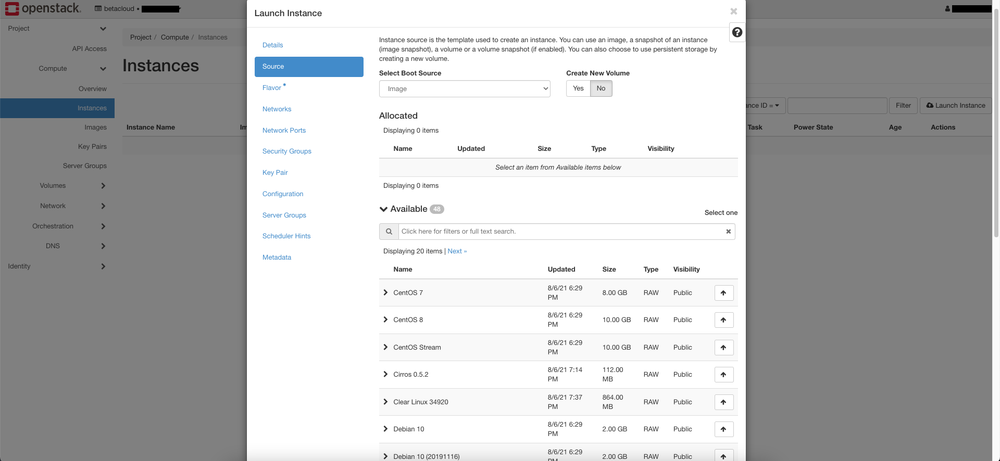

=======================
How to create Instances
=======================

At first click on the right side on Instances.
After this click on the instances screen on the upper right on "Launch Instances".
You will get the following screen:

--------
Details:
--------

    - Instance Name: "Name of the Instance"
    - Description: A short describtion from the Instance, so you can better differentiate the Instances.
    - Availability Zone: per default is choosen Any availability Zone. If you want a special one choose one of them are given.
    - Count: Means how many Instances you want to create.

-------
Source:
-------

    - Select Boot Source: Here you can choose from witch source your images should be. (Image, Instance Snapshot, Volume or Volume Snapshot).
    - Create New Volume: By default it is on No. If you want specialize the size of the storage you can set it to Yes.
    - Under the point available you can search and choose existing images.

--------
Flavour:
--------

    - Select the flavor you want to have. (How many VCPUs you need, how many RAM and how many Disk Space you need)
      To select one press the upper arrow on the right. It will show your selected flavor above now.

--------
Network:
--------
    
    - If you have more than one configured networks, choose here the one you want to use.

-------------
Network Port:
-------------
    
    - If you configured before notwork ports or network ranges you can choose them in this section.

-----------------
Secrurity Groups:
-----------------

    - You can choose the Security Group what you needed. If you need another one than default, you have to create one first.

---------
Key Pair:
---------

    - Here you can create or import a SSH Key if you haven't done it before. If you already did this you can choose the needed Key from list.  
    - By default one is choosen, when you created one before.

--------------
Configuration:
--------------

    - In that section you can load customization scripts. These are scripts where you can automatically create partitions or directories for example. You can do a lot with those scripts.

--------------
Server Groups:
--------------

    - If you have configured Server Groups you can choose them here.

----------------
Scheduler Hints:
----------------

    - Betacloud currently does not offer scheduler hints, only availability zones.

---------
Metadata:
---------

    - Here you can choose metadata. It will be automatically installed for you. So you don't have to install it after configuration from your instance one by one by hand.

-----
Ready
-----

Now you are ready to work with your instances.
It should be listed now:

After setting up you can manage your instances by clicking on each instance on the name. Or you click on the arrow behind the instance.
If you click on the Name from the instance, you will get a lot of options:

    * Get detailed information about your instance in ``Overview``.
    * Get information about your interfaces and you can edit the Security Groups in ``Interfaces``.
    * Look up at the logs in ``Log``.
    * Have a console to work on the Interface with ``Console``.
    * Get an Log about the actions which are done, like create, start or stop in ``Action Log``.
    