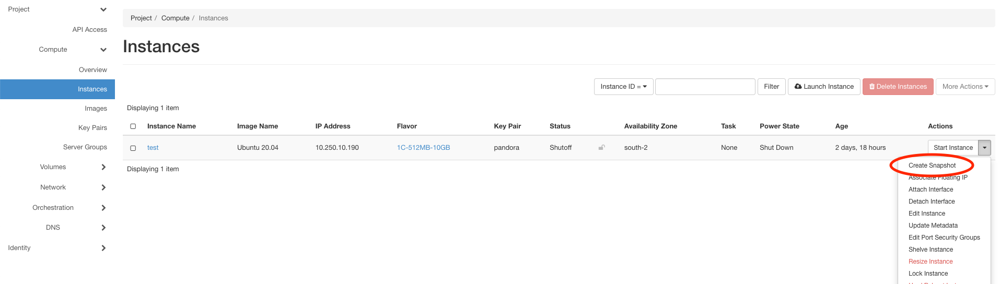

======================
Make and use Snapshots
======================

You can create Snapshots from your instances to use them as a backup, or if you want to create the same instance again.
Click behind the instance an the arrow and navigate to snapshot:

Name the snapshot maybe with instancename-date or something like that, so you can find it better in the future.

The snapshot will be stored in the imagelist under the name you choose before:

Now you can use the snapshot like images.
