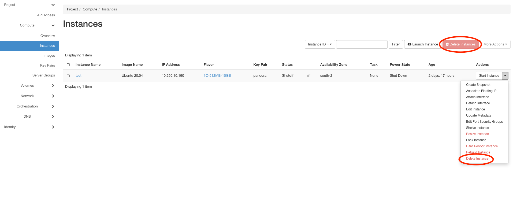

================
Delete Instances
================

If you don't need your instance anymore you can delete your instance. 
But before that make sure that you made a backup from the data on it.
Because the data on the instances will be delete permanently.

You have more than one way to delete your instances. Two are shown in the picture above.
The first way is to click on the red button with delete instance. Be careful if you have more than one instance, that the right instance is choosen.
The second way is to click on the arrow behind the instance and than navigate on delete instance.
But please remember: All data on the instance will gone permanently. So make sure you have a backup from the data, if you need one.
