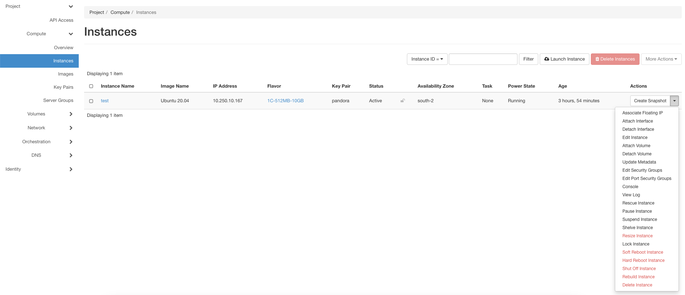
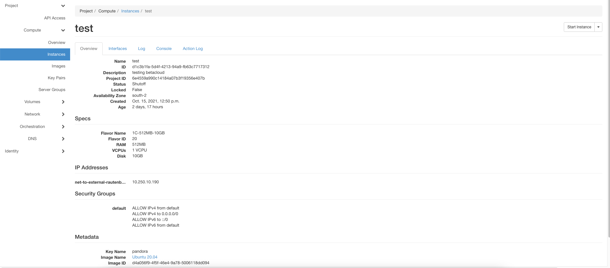

================
Manage Instances
================

After creating you can manage your instances. Like scaling up or down, reboot, shut off or rebuild the instance. Or you want to create a snapshot or update the metadata.
All this and some more you can do in the Instance section by clicking on the arrow button behind the instance in the list.

If you click on the Name from the instance, you will get a lot of options:

    * Get detailed informations about your instance in ``Overview``.
    * Get information about your interfaces and you can edit the Security Groups in ``Interfaces``.
    * Look up the logs in ``Log``.
    * Have a console to work on the Interface with ``Console``.
    * Get a Log about the actions which are done, like create, start or stop in ``Action Log``.

