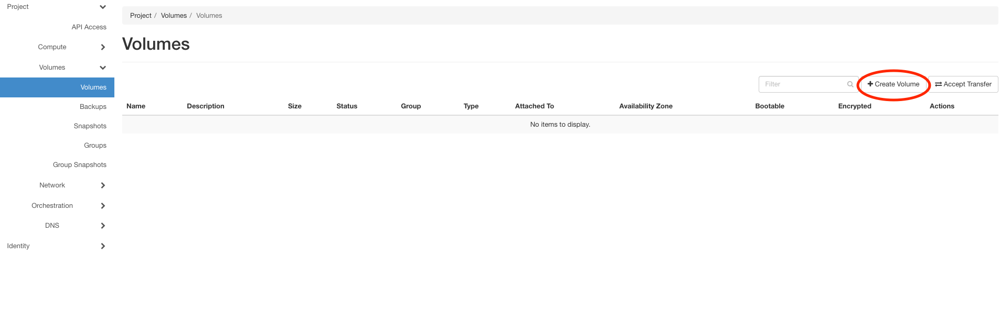
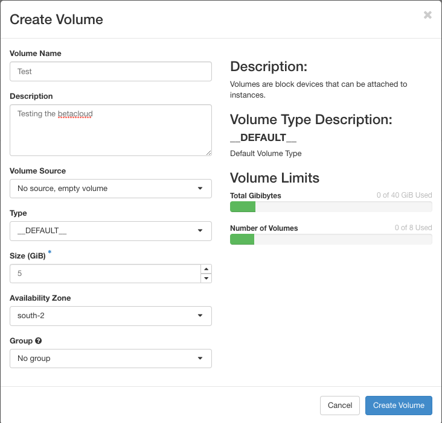

==============
Create Volumes
==============

This sectrion will explain how to create volumes.

* First click on the left side on :guilabel:`Volumes`.
* After this click on :guilabel:`Create Volume`.

* Now fill out the fields and choose the Size, the Type, the Avaibility Zone and if you already have some the group.
  If you want create an image on the volume you can change the Volume Source to image and take the image you want.

* At the end click on Create Volume and the volume is ready to use now. It will be shown in the Volumeslist.
