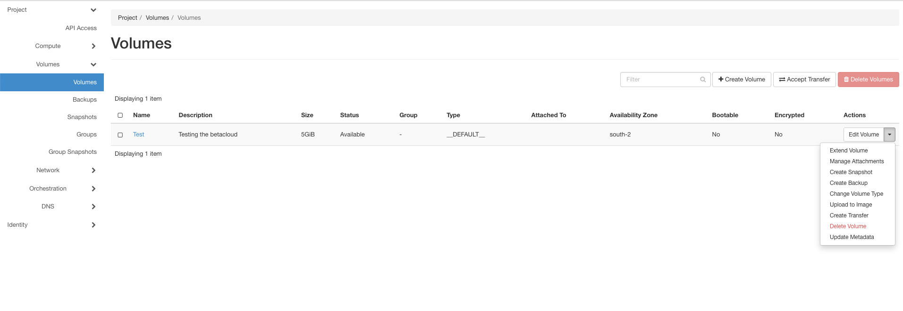

==============
Manage Volumes
==============

Once created you may to need to manage your instances.
Maybe you want to resize your volume, or want to create snapshots and backups.
There are many options to manage your instance. 
Some often used options we will describe in other sections, like create snapshots, create backups or delete Volumes.

Like instances you can click behind your volumes in the volumelist on the arrow to manage your volumes:

* extend volume: resize the volume. If you need more space.
* Manage Attechments: If you create a new volume it is by default without a VM. If you want to concatenate a volume with a instance you can do it here.
* Create Snapshot: Snapshots are needed to reuse them later. This we will described in detail later.
* Create Backup: That isn't a supported feature from Betacloud at this time.
* Change Volume Type: Here you can change the volume type.
* Upload to Image: You can upload a volume to use it later as an image, like snapshots.
* Create Transfer: With Create Transfer you can move one Volume to another Project.
* Delete Volume: Be careful! If you forget to safe the data on this volume it will be deleted permanently. If you don't have a backup the data is lost.
* Update Metadata: In this section you have many metadata that you can install by the console.

