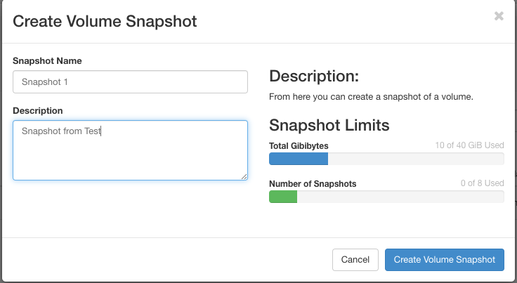
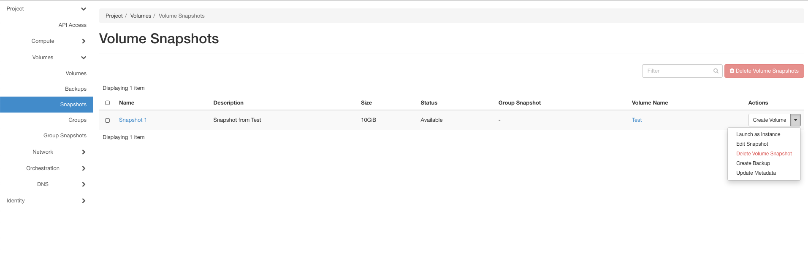

=========
Snapshots
=========

It is always the best practise to safe important data in more than one way. If your instances or volumes crash, your data might be lost.
If you have important data that can't be rebuild fast and easy it is best practise to use snapshots or backups.
:guilabel:`Snapshots` are a snapshot from the whole Volume at the point of creating.
:guilabel:`Backups` are a copy from data that is defiend.

--------
Snapshot
--------

It is the best to make snapshots only from not attached volumes. If they are running it can results in a corrupted snapshot that isn´t useable.

If you want to use the snapshot, you will find this under Snapshots. There you can use, delete and manage your snapshots.

