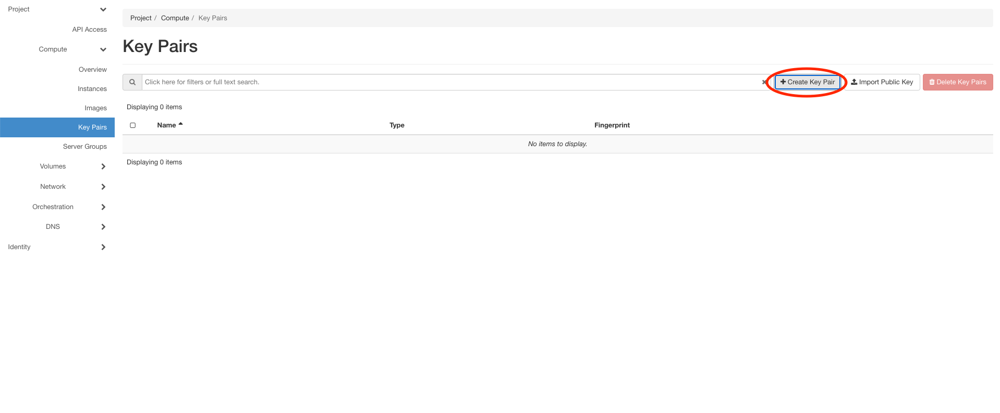
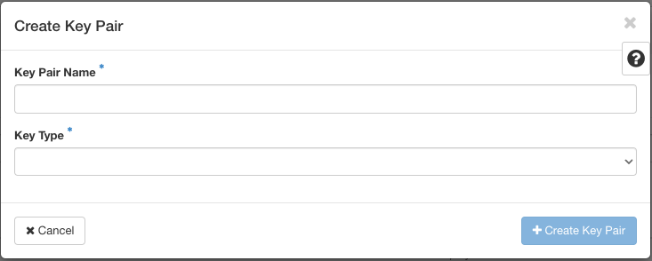
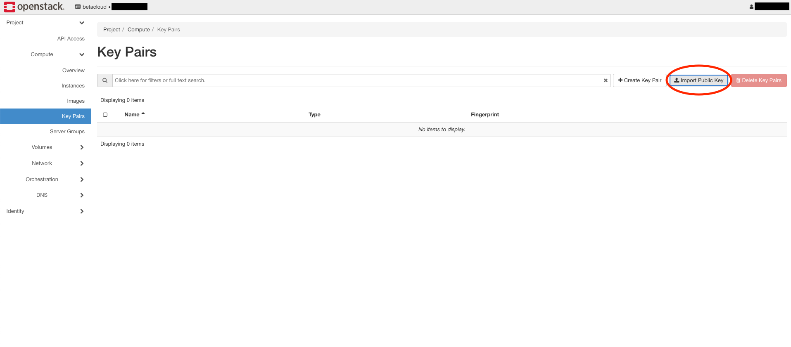
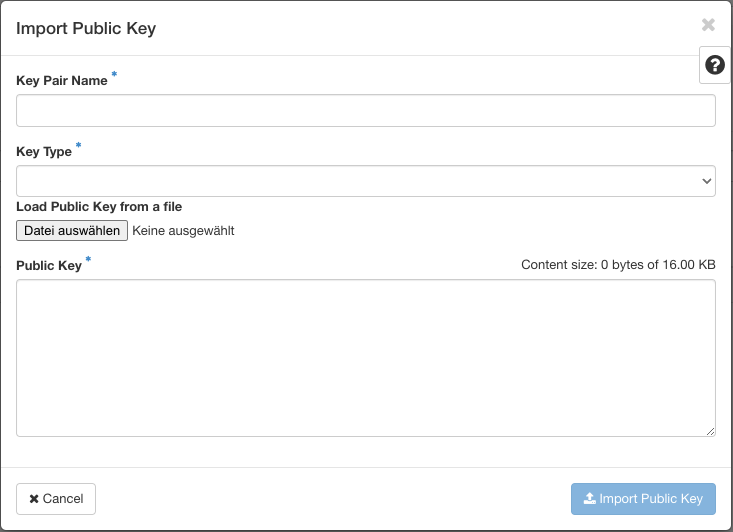
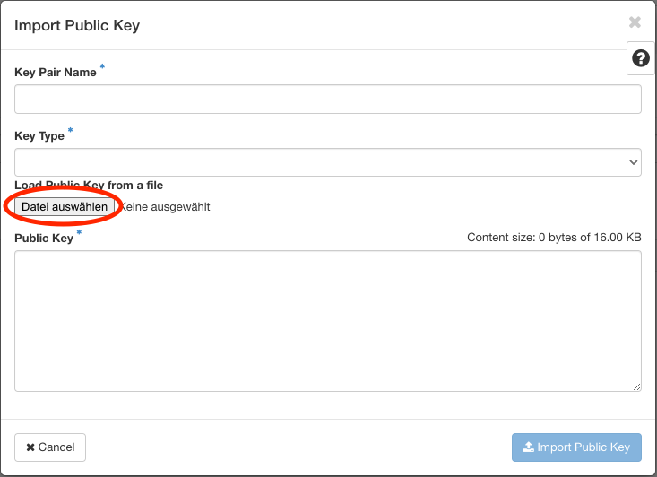

==================================
How to create and store a Key Pair
==================================

In the browser click on Key Pairs and than on create Key Pair.

After this you can create a key pair:

* Give the Key a unique name, for easier identification for you.
* Choose the Key Type.

A download with the key what you will needed to store on your machine will started automatically.
It is the best practise to store this file, what should have the ending .pem, under your .ssh folder.
Dont forgett to set the rights.

.. code-block:: bash

    chmod 600 "file".pem

Now you have to create a rule that you can connect to the instance from remote.
How to do this will be explained in the section ``create security groups``.

=============================
How to import and store a Key
=============================

On your commandline you type:

.. code-block:: bash

    ssh-keygen

After this copy the output from the file /.ssh/id_rsa.pub

.. code_block:: bash

    cat /.ssh/id-rsa.pub

Than click on import and store the key:

* Give the Key a unique name, for easier identification for you.
* Choose the Key Type. In this example it is ssh
* Paste the output from id-rsa.pub in the Public Key field.
* Click on Import Public Key

You can also import your id-rsa.pub file if you want.
For this variant you must first download the file.
After this press the button for searching file:

Search the file in your downloadfolder and take it.
Again to finish this step click on Import Public Key.
You have to create a rule for using SSH connections. How to do this will be described in the section ``create security groups``.
