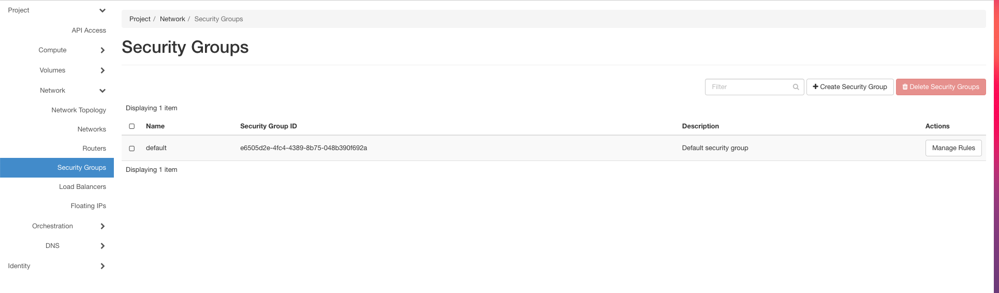
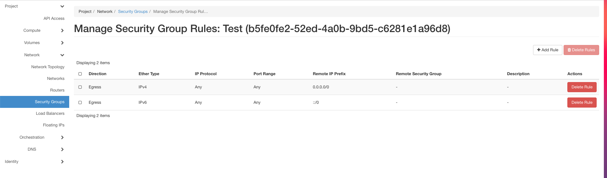
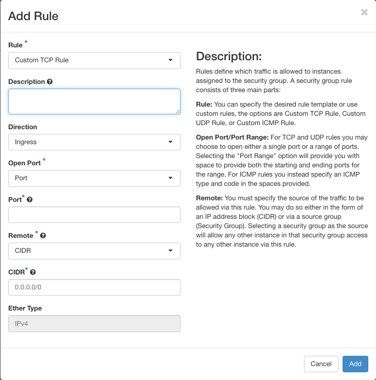
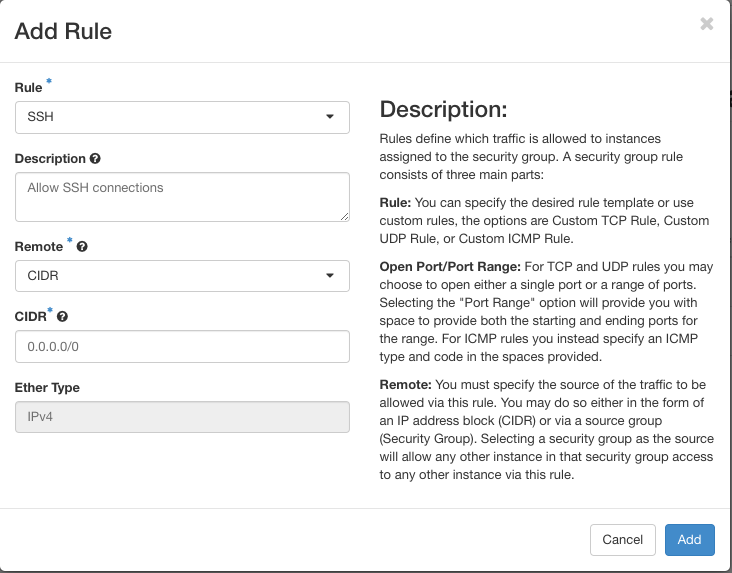
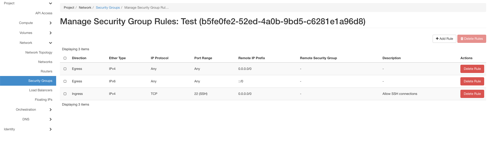
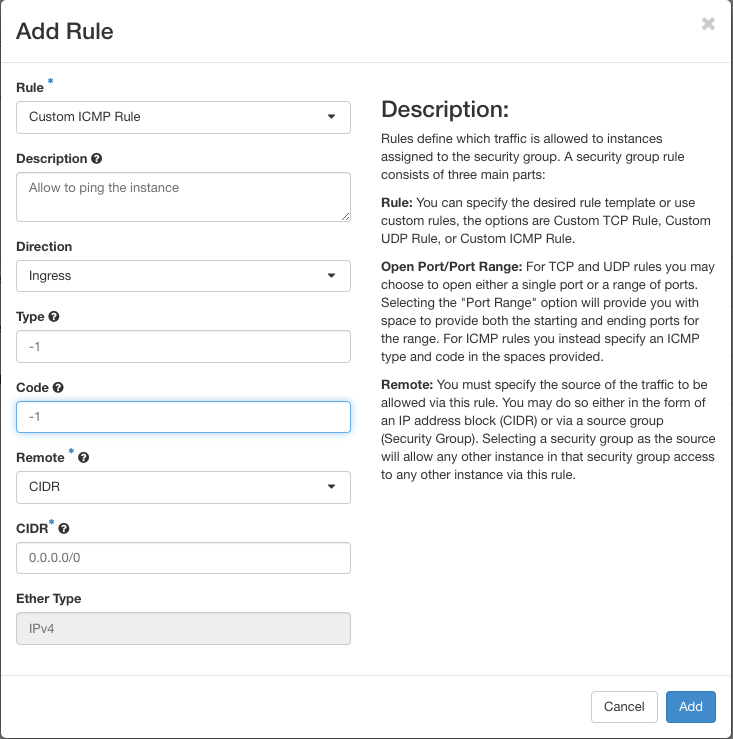

===============
Security Groups
===============

By default all ingress traffic is forbidden. You can not connect via ssh or ping the instances.
For every ingress traffic you have to declare rules. Because it is time and work consuming to declare every rule and assign it to every instance,
you can declare secrurity groups with all rules they should have. Best practise is: open only what you really need.
For creating security groups do the following steps:

* Click on the left side on ``Security Groups``.



* Click on create Security Group.

* Give the security group a name and a description.

* Confirm with ``Create Security Group```

After this steps you will automatically be forwarded to this screen:



In this section you can add rules.
Let's explain two rules in detail:

SSH Rule
--------

If you want to connect to your instance from your own machine, you have to allow SSH connections first.
How to do:

* Klick on add Rule. You will get this screen:



* Now choose in the Rule dropdown-menu ``SSH`` and describe the rule.
* You can configure the ``CIDR``, which means the range off ip addresses which can connect to your instance.



* After that don't forget to press ``Add`` for adding the rule.

Now the list should look like this:




Ping Rule
---------

Sometimes it is good for debugging if you can ping your instance from outside.
Because all ingress traffic is forbidden by default ping dosen't work, too.
So you have to allow this first with creating a new rule like this:

* Like before click on add rule.
* For this rule choose in the dropdown-menu the point ``Custom ICMP Rule`` and describe it.
* The Direction means the incoming (Ingress) or outgoing (Egress) traffic. In this example we need Ingress.
* In the fields ``Type`` and ``Code`` type -1. This allows access to all codes and all types of ICMP traffic.



The new rule should be now listed too.