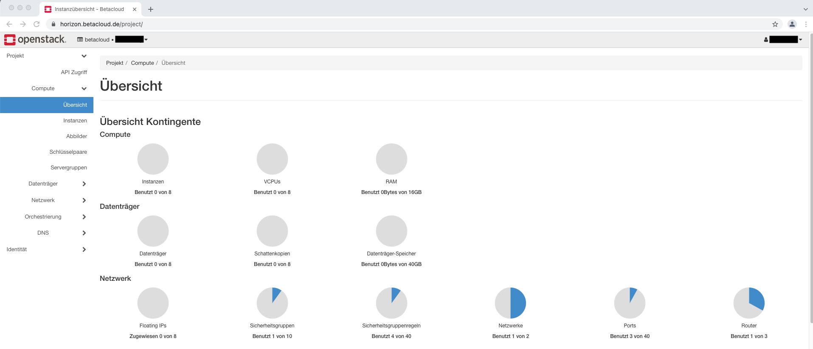
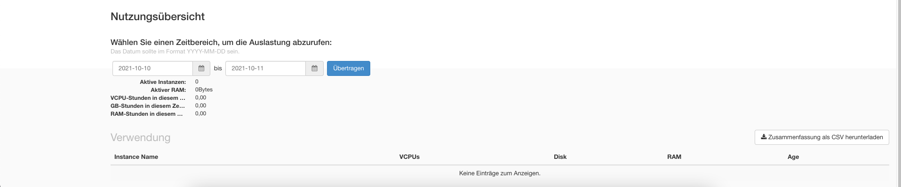
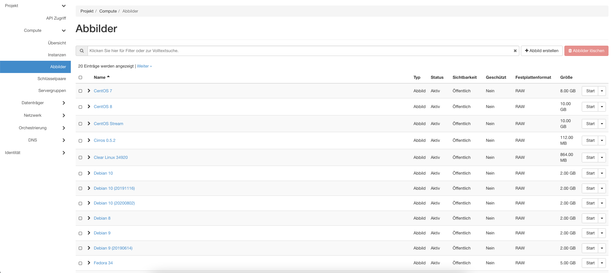

****************************
Overview about the Dashboard
****************************

* The first screen what you see after log in is an overview about your instances, space and network. 
* In the usage overview below you can see what you used and when. You can chose the period to look for the utilization in that period of time.
* After that, in the use section, you can see what instances are up, the usage and the age from the instances.

=======
Project
=======

Underneath the left pane project you will find following underpoints:

-------
Compute
-------

^^^^^^^^
Overview
^^^^^^^^

Which is described above, because that is the startscreen.

^^^^^^^^^
Instances
^^^^^^^^^

Here you can manage your instances.
We will come to this in the section create and manage Instances again.

^^^^^^
Images
^^^^^^

In that section you can find images for your instances. You can deploy own images there, too. 

^^^^^^^^
Keypairs
^^^^^^^^

Here you can add, manage or delete your keypairs.
It shows you your already configured keypairs in form of a list.

^^^^^^^^^^^^^
Server Groups
^^^^^^^^^^^^^

In this section you can add, manage or delete your server groups.
You have an overview about your created Groups, too.

-------
Volumes
-------

Gives you an overview about your already created volumes and much more informations about this volumes. 
You are able to manage, create and delete there, too.

^^^^^^^
Backups
^^^^^^^

If you take Backups from your VM's, they will stored here.
In this section you can see your stored Backups. You can also manage or delete them.

^^^^^^^^^
Snapshots
^^^^^^^^^

Here snapshots from the volumes will be stored.
You get an overview about the snapshots you made. Here you can manage your snapshots, too.

^^^^^^
Groups
^^^^^^

In Groups you can create, manage and delete Volumegroups.
This Volumegroups will be shown in a list if you create some.

^^^^^^^^^^^^^^^
Group Snapshots
^^^^^^^^^^^^^^^

Group Snapshots are Snapshots from your Volumegroups. If you create some they will be stored here.
In this section your can manage you Group Snapshots if needed.

-------
Network
-------

In this sidemenu you can find:

^^^^^^^^^^^^^^^^
Network Topology
^^^^^^^^^^^^^^^^

A graphical overview of your networks.

^^^^^^^^
Networks
^^^^^^^^

In this section you can manage, create and delete your networks.
If you have created a network you can create subnets, too.
You get an overview about your networks in a list.

^^^^^^^
Routers
^^^^^^^

You can view and create virtual routers here.

^^^^^^^^^^^^^^^^
Secrurity Groups
^^^^^^^^^^^^^^^^

At default network defices like virtuell machines are not able to recieve any traffic.
You need to explicitly define allowed networkports or ranges via secrurity groups.
Icmp (ping) is also blocked by default.

^^^^^^^^^^^^^^
Load Balancers
^^^^^^^^^^^^^^

You can create Load Balancer which distribute the traffic over the machines you have configured. 

^^^^^^^^^^^^^
Floating Ip's
^^^^^^^^^^^^^

By default VM's are not reachable from outside. If you want to set your Project, VM, Network or Routers
to be reachable you have to asssign a floating ip to them.

-------------
Orchestration
-------------

The orchestration is more for advanced users. Here you have the tools for automation.
With Heat for example you can automatically hold a state of VM's. 
If you use Heat you can define how many VM's should to be up from one sort. 
So if you delete one vm another will be spawned automatically from Heat.
How to use this utils and how to manage it, please look in the documentation from these utils.

----
DNS
----

In this section you can configure DNS Zones and make them available.

========
Identity
========

Under this section you have the following sub-points:

--------
Projects
--------

Here you'll see your created projects. If you are the administrator you can create new projects

-----
Users
-----

In this section will be shown the list of users. If only you use your Betacloud-project only your name should be shown.
As an administrator you can create new users.

-----------------------
Application Credentials
-----------------------

With the Application Credentials you can configure external programms for automation and define fine grained policies for each application.
